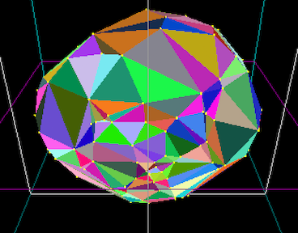

## Project 5:  3d Convex Hull 


*** 
* __Assigned:__ Wednesday November 6th
* __Due:__   Wednesday November 20th 
* Group policy: Partner-optional 
* Collaboration policy: Level 1

In this project you will write code to compute the convex hull of a set of points in 3D, using either gift wrapping or the incremental algorithm, both of which run in quadratic time. To showcase the hull you will animate drawing the hull one face at a time, while the whole hull is rotating. 




***

### Overview

You will receive starter code on Github which handles the interface, generating the points and rendering them.  Your main task is to fill in  the function the computes the hull. You can choose to implement either the gift wrapping or the incremental algorithm. 

Whichever algorithm you choose to implement, we will make the following simplifications: 
* store the hull as a vector of faces. you do not need to store the topology between faces and edges (i.e.  what how faces and edges are adjacent  to each other)
* you do not need to handle  coplanar points. Most likely this means that for coplanar faces, you will generate many and possibly overlapping triangles -- that is fine, given the timing of this project.   While at it, consider how you might solve this problem if you had more time.  

### Startup code 

There are issues with infront/behind predicates when using points with  floating point coordinates. The basic problem is the following:  if p is in front of abc, and q is in front of abp,  it  should imply that q is in front of abc.  But it can be that the general position of a, b, c, p and q is so that the volume of abcq is very small, and transitivity dos not hold. This leads to all sorts of assert fails, where faces that are supposed to be extreme, are not. The solution here would be to use a geometric library that implements  infront/behind with arbitrary precision. This can be done, but  for this project, it's not worth the setup.  What we'll do instead is we'll be switching to integer coordinates.

```
typedef struct _point3d {
     int x, y, z; 
}
```

Github  includes code for a bunch of pimitives, including:

```
long long  signed_volume(point3d a, point3d b, point3d c, point3d d) 
bool face_is_extreme(int i, int j, int k,  vector<point3d>& points) 
```

### Gift wrapping: Finding the first face on the hull 


In case you choose to  implement gift wrapping, finding the first face on the hull is surprisingly not straightforward, and Github includes the code for  it: 

```
// finds and returns a face on the hull
triangle3d find_first_face(vector<point3d>& points) 
```

To find the first face, the idea is:
* find an extreme point , like the right most , call it first
 
 ```
 //return index of  point with max x-coord 
int find_right_most_point(vector<point3d>& points) {

  if(points.size() == 0) return -1;
  
  int rightmost = 0;
  for (int i=1; i< points.size(); i++){
    if (points[rightmost].x < points[i].x) {
      rightmost = i;
    }
  }
  return rightmost; 
}
```

* project all points on the xy-plane (ignore their z-coord).   first is on the 2dhull of the projection. 2d-gift wrap from first  to find  the next point second  that is right-most when looking from first . Edge (first, second) is on the 2d hull of the projection, and therefore on the 3d-hull.  This is written in the helper function :

```
//return an edge on the hull 
edge3d find_first_edge_on_hull(vector<point3d>& points) {

  int first_index = find_right_most_point(points);
 
  //project all points onto z=0 plane and 2d gift-wrap to find first edge from first_point
  point2d first = {points[first_index].x, points[first_index].y};
  int second_index = -1;
  point2d second = {0, 0}, p;
  for (int i=0; i<points.size(); i++) {
    if (i==first_index) continue;

    p.x = points[i].x; p.y= points[i].y; //current point 

    if (second_index==-1) {
      second_index = i; second.x =  points[i].x; second.y = points[i].y;
    } else {
      if (right_strictly(first, second, p)) {
	          second_index = i; second.x = points[i].x; second.y = points[i].y;
      }
    }
  }//for

  //sanity check that edge is indeed extreme 
  assert(is_edge_projection_extreme(first_index, second_index, points)); 
  
  edge3d e = {first_index, second_index, &points[first_index], &points[second_index] }; 
  return e; 
}
```

* And finally, find the third point so that (first, second, third) is a face on the hull3d.

```
/* ************************************************************ */
/* finds and returns a face on the hull3d */
triangle3d find_first_face(vector<point3d>& points) {
  
  edge3d e = find_first_edge_on_hull(points);
  int first_point = e.ia;
  int second_point = e.ib;
    
  //first_point and second_point are both on the hull. Find the third point similarly.
  int third_point = pivot_around_edge(first_point, second_point, points);
 
  triangle3d t;
   ...
  return t; 
}
```

All these functions are written,  take a look and understand how they work.
What's left is to  write the gift_wrapping  code.

```
/* compute the convex hull of the points */
void giftwrapping_hull(vector<point3d>& points, vector<triangle3d>& hull) {

   hull.clear(); //to be safe
   
  //your code goes here
   triangle t = find_first_face(points); 

   //main loop ....
   //note: you will use pivot_around_edge 
} 
```


### Deliverables/What to turn in

You will receive the assignment on GitHub. Your github repository shoud contain:
- your code (computing hull3d + animation one-face-at-a-time)

- The README file is the landing page for the repository and should contain: (1) a one-sentence description of what the code is doing. and (2) instrutions on how to run it. Totally fine to keep it minimal, but anyone shoud be able to run your code after looking at your README.
- A brief report showcasing your project, containing:
	- (1) images of your hulls. There isn’t a required number of images, include what you consider a representative sample
	- (2) if your code does not work in all cases, explain.
	- (3) any extra features you implemented.
	- (4) Time you spent in: Thinking; Programming; Testing; Documenting; Total.
	- (5) Brief reflection prompts (you don’t need to address all): how challenging did you find this project? what are some things you learnt by doing this project? Is there anything you wish you did differently? If you worked with a partner, how did that go? Is there anything you would like like to explore further?
	- (6) Capture a movie of the screen while you demo your code and upload it to github as demo.mov. To demo, no voice, just run your code and show what it can do (To capture a movie on a Mac press shift+command+5 and then choose the option that says record selected portion).


