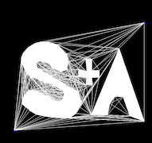
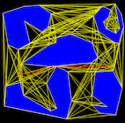

## Project 6:  Path Planning via Visibility Graph

*** 
* __Assigned:__ Suday, November 17
* __Due:__  as soon as you can after the break
* Group policy: Partner-optional 
* Collaboration policy: Level 1
 

In this project you will implement geometric motion planning for a point robot
moving among polygonal obstacles in 2d  using the visibility
graph (VG) approach.

 

### Overview

One of the fundamental problems in robotics is motion planning: given
a robot moving in an environment (or: physical space), a start position
and an end position, find a path so that the robot can
move from start to end, without collisisons. Generally speaking, in
most situations we are happy to compute just a path, not necessarily
the optimal/shortest, but in some special situations we are able to compute
an optimal (shortest) path.

In this first project we will consider a simple instance of the path
planning problem and make some simplifying assumptions which will
allow us to do optimal planning:

 - 2D: We'll assume that the environment consists of a set of 2D
   polygons that represent the obstacles. Furthermore, we assume that
   the robot is moving in a large bounding box B that contains all
   polygons.

- Static: We'll assume that the environment is static (the obstacles
  are fixed and do not move).

- Known: The environment is known, i.e. the robot knows the list of
  obstacles with their vertices and edges. That is, the robot does not
  rely on sensors to learn the environment, instead the environment is
  given.

- Point robot: the robot is assume to be a point (yes, that's not very
  realistic, but it's a good place to start).

The general idea of motion planning is to construct a representation
of the free space (the space where there are no obstacles and the
robot can move).  The representation is called a roadmap and is
essentially a graph of free space. Ideally we want to build the
roadmap so that:

1. Any path in the road map corresponds to a collision-free path in the free space.
2. Any path in the free-space corresponds to a path in the road map.

If we are able to compute a road map of free space with these
properties, then to move from a location s to a location t, we will find a path in the road map
from s to t. We know that any path in the road map is colision-free
(by (1)), and we know that if a path in the road map does not exist,
then no path exists (by (2)). Essentially we have reduced the motion
planning problem to a path problem in a graph.

There are several types of roadpams that have been used, depending on
the specifics of the problem.  For a point robot moving among
polygonal obstacles in the plane, it is possible to construct a type
of roadmap that will allow to compute optimal paths: the visibility
graph.  This is a graph whose vertices are the vertices of the
obstacles, and its edges (u,v) are all the pair of vertices that can
"see" each other, that is, segment uv does not intersect the interior
of any obstacle. Some screenshots above and below.

 

Shortest paths in 2D have the very nice and convenient property that
they are straight lines, and they have to go through the vertices of
the obstacles (a path that takes you to a point interior to an edge and then continues to a vertex is not shortest). This basically means that any shortest path will be
contained in the VG. Once the visibility graph (VG) is computed, the
shortest paths from start to end can be computed for e.g. using
Dijkstra's algorithm.

### This project

1. When you start your code, have a pre-set scene with polygonal
obstacles.  Allow the user to reset the scene and and enter polygons
using the mouse (in a manner similar to previous projects).  

2. Once the scene is done, compute and render the visibility graph.

3. Allow the user to click on the start and end position of the
"robot" in the scene. Then, run Dijkstra's algorithm on the VG and
render the resulting path (for e.g. in a different color and different
line width). Let the user enter different start and end positions and re-compute the path. 

All the geometric primitives that you'll need for this project, you 
already have them.  So that part should feel easier. The new part
is implementing Dijsktra's algorithm. In csci2200 we discussed the
pseudocode for Dijkstra. In this project you have an opportunity to
work through  the details.

### Dijkstra's algorithm 

In theory we always assume that the graph is given nicely in an
adjacency list form.  Here you have a bunch of edges, and
you will need to  create an adjacency list for the VG graph.

Once you have an adjacency list, you can pretty much use Dijkstra's algorithm straight out of a textbook.

## Extra features

* Implement a point-in-polygon method and use it to detect if start or
  end points are inside an obstacle.
* Detect if a polygon is self-intersecting.
* Detect if polygons are overlapping.
* Draw the polygons filled. Note that openGL can only fill correctly
  convex polygons, so if you want it filled, you'll need to compute a
  triangulation.

### Deliverables/What to turn in

You will receive the assignment on GitHub; it contains no code. Your github repository shoud contain:

* your code 

* The README file is the landing page for the repository and should
contain: (1) a one-sentence description of what the code is doing. and
(2) instrutions on how to run it. Totally fine to keep it minimal, but
anyone shoud be able to run your code after looking at your
README. It's also good practice to include there the bugs or
limitations of the project, so that anyone running is aware.

* A brief report showcasing your project, containing:
	* (1) images of your visibility graph and paths.  There isn't a required number of images, include what you consider a representative sample. 
	* (2) if your code does not work in all cases, explain.
	* (3) any extra features you implemented.
	* (4) Time you spent in: Thinking; Programming; Testing; Documenting; Total.
	* (5) Brief reflection prompts (you don’t need to address all): how
challenging did you find this project? what are some things you learnt
by doing this project? Is there anything you wish you did differently?
If you worked with a partner, how did that go? Is there anything you would like  like to
explore further?

* Capture a movie of the screen while you demo your code and upload it
  to github as `demo.mov`. To demo, no voice, just run your code and
  show what it can do (To capture a movie on a Mac press
  `shift+command+5` and then choose the option that says `record
  selected portion`).

